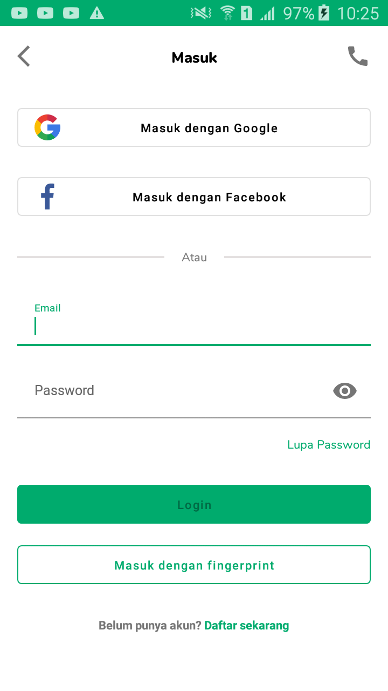
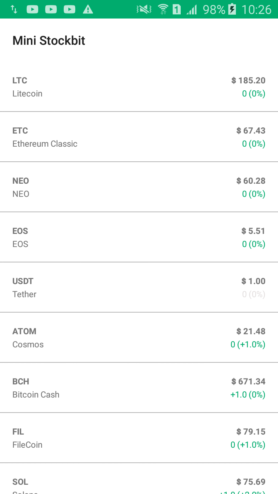

# MiniStockbit
project testing dari stockbit

## Create Mini Stockbit App di halaman Login dan Watchlist.
Must have:
- [x] Single Activity Architecture (use navigation component)
- [x] Implementation of Dependency Injection eg. Koin
- [x] Relevant implementation of Coroutine for asynchronous task
- [x] Unit testing, preferably using Mockk
- [x] Appropriate use of Loading/Error state between process / page transitions
- [x] Implementation of Room Database to cache previously loaded Watchlist data ie. tampilkan data dari Room terlebih dahulu, kemudian baru Request API

Nice to have:
- [x] Multi Module Architecture
- [x] Use Material Design

## Preview

  

## Screenshot

  
  
  

## Architecture

Modularization, based on Clean Architecture divided into three main modules
- [x] Data (Mostly for calling API)
- [x] Domain (More like mediator between Data and Presentation)
- [x] Presentation (UI and business logic)

## Libraries

#### Core & Jetpack

- [x] [LiveData](https://developer.android.com/topic/libraries/architecture/livedata)
- [x] [ViewModel](https://developer.android.com/topic/libraries/architecture/viewmodel)
- [x] [Coroutines](https://developer.android.com/topic/libraries/architecture/coroutines)
- [x] [Retrofit](https://square.github.io/retrofit/): Networking
- [x] [View Binding](https://developer.android.com/topic/libraries/view-binding)
- [x] [Koin](https://start.insert-koin.io/#/quickstart/kotlin): Dependency Injection / Service Locator
- [x] [Jetpack Navigation](https://developer.android.com/guide/navigation/navigation-getting-started)

#### Development, Debug & Test

- [x] [MockK](https://mockk.io/)

## API

Using CryptoCompare API . 
- [x] [REST API](https://min-api.cryptocompare.com/documentation)

## Add Other Function
- [x] Chuck (Mostly for show data calling API)
- [x] Build Variant (Build apk any Server)
- [x] Validasi input (Format mail and empty)

